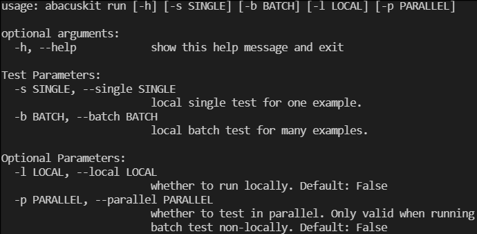
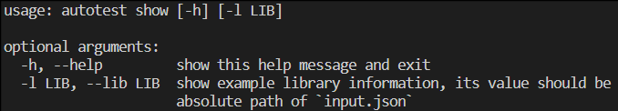

<!--
 * @Date: 2021-03-29 09:04:56
 * @LastEditors: jiyuyang
 * @LastEditTime: 2021-04-29 17:31:28
 * @Mail: jiyuyang@mail.ustc.edu.cn, 1041176461@qq.com
-->
# ABACUS自动测试
pyautotest是一个以工作流方式进行ABACUS自动测试的程序，并且可对ABACUS计算结果进行后处理。

## 特点
- **工作流**：自动完成输入文件的生成，计算任务的提交以及输出文件的分析等一系列工作，支持串行完成多个计算
- **批量计算**：支持批量提交多个计算任务
- **外部代码接口**：支持外部Python脚本处理，如轨道生成，基于off-site辅助基的杂化泛函计算
- **调度器接口**：程序拥有多种调度器接口，包括：SLURM, PBS Pro, torque, SGE和LSF等
- **后处理**：基于ABACUS输出的数据文件画能带和DOS（PDOS）图

## 安装
```shell
python setup.py install
```

## 使用
支持命令行模式和脚本模式。命令行模式需要输入文件`input.json`（样例可见`testlib\input.json`，其它可用参数见**附录**），可自动创建提交脚本并提交任务；脚本模式不需要输入文件，调用相关函数即可。

### 命令行

#### 任务提交

  
#### 显示信息


## 测试库
执行自动测试的前提时需要准备一个测试库（样例可见`testlib`），准备好后，每次测试只需指定测试库所在路径（`src`）即可。测试库中必须包含配置文件`config.json`（配置参数可见**附录**）以及配置文件中指定的其它输入文件。

# 附录
## `input.json`参数说明
- **src**：测试目录路径
- **dst**：工作目录路径
- **version**：ABACUS版本列表
- **external_command**：轨道生成、EXX计算需要用外部Python脚本，该参数指定相应命令行
- **job_resource**：作业所需资源。下面前三个参数主要用于PBSpro、SLURM和Torque，后两个主要用于SGE和LSF
  - **num_machines**：需要多少机器（节点）
  - **num_mpiprocs_per_machine**：每个机器（节点）上需要运行多少MPI进程
  - **num_cores_per_machine**：每个机器*（节点）上需要多少核
  - **parallel_env**：配置并行环境
  - **tot_num_mpiprocs**：总进程数
- **save_files**：默认为true，表示保留串行计算上一个计算任务的输入文件，防止被覆盖。
- **script_params**：调度器作业提交脚本的参数设置，除**scheduler**必选外，其他参数均为可选
  - **scheduler**：（必选）支持`"pbspro"`，`"slurm"`，`"torque"`，`"sge"`，`"lsf"`
  - **shebang**：提交脚本的第一行，默认为`null`，即提交脚本第一行默认为`#!/bin/bash`
  - **job_environment**：导入作业所需环境，例如：{"OMP_NUM_THREADS":28}
  - **submit_as_hold**：若设置则作业提交后将处于HOLD状态
  - **rerunnable**: 作业是否可重复执行
  - **working_directory** 作业的工作目录，SGE可设置
  - **email** 作业信息将发送到该邮箱地址
  - **email_on_started**：如果为`true`，则要求调度器在作业开始时发送一封邮件
  - **email_on_terminated**： 如果为`true`，则要求调度器在作业结束时发送一封邮件
  - **job_name**：作业名
  - **sched_output_path**：作业标准输出文件的绝对路径
  - **sched_error_path**: 作业标准错误文件的绝对路径'
  - **sched_join_files**：如果为`true`，则标准输出和标准错误在同一文件
  - **queue_name**：作业所属队列名
  - **account**：调度器账户
  - **qos**：调度器账户的服务器质量
  - **priority**：作业优先级
  - **max_memory_kb**：每个节点上作业最大可用内存（单位：kB）
  - **max_wallclock_seconds**：作业最大可用时间（单位：s）
  - **custom_scheduler_commands**：字符串将被插入到最后一条调度器命令之后，以及所有非调度器命令之前
  - **prepend_text**：字符串将插入到可执行命令之前
  - **append_text**：字符串将插入到可执行命令之后
  - **import_sys_environment**：若为`true`，导入系统环境变量

## `config.json`参数说明
- **workflow**：必要参数
  - **cal_\***, `*`为从0开始的整数，必须依次设置，不能跳跃设置，即只设置`cal_0`和`cal_2`，不设置`cal_1`
    - **name**：用于指定计算名称：文件名.类名。例如：`scf.SCF`，`opt_orb.LCAO`等
    - **code**：用于配置命令行
      - **cmdline_params**：一系列命令行参数字符串组成的列表 
      - **withmpi**：MPI命令（如`mpirun`，`mpiexec`），若不需要MPI则设为`null`
      - **stdin_name**：标准输入文件名
      - **stdout_name**：标准输出文件名
      - **stderr_name**：标准错误文件名
      - **join_files**：如果设为`true`，则标准输出和标准错误信息在在同一文件中显示；否则在不同文件
    - **input_params**：中参数对应ABACUS的INPUT文件中输入参数，具体可见ABACUS手册
    - 其余参数取决于具体计算
