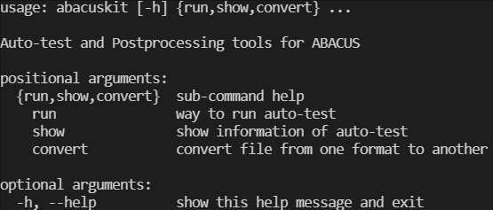
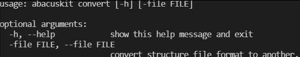

<!--
 * @Date: 2021-03-29 09:04:56
 * @LastEditors: jiyuyang
 * @LastEditTime: 2021-04-29 17:31:28
 * @Mail: jiyuyang@mail.ustc.edu.cn, 1041176461@qq.com
-->
# ABACUSkit
abacuskit是一个以工作流方式进行ABACUS自动测试的程序，并且可对ABACUS计算结果进行一系列后处理操作。

## 特点
- **工作流**：自动完成输入文件的生成，计算任务的提交以及输出文件的分析等一系列工作，支持串行完成多个计算
- **批量计算**：支持批量提交多个计算任务
- **外部代码和库接口**：支持外部Python脚本处理，如轨道生成，基于off-site辅助基的杂化泛函计算；基于Spglib和SeekPath库进行对称性分析和能带路径查询
- **调度器接口**：程序拥有多种调度器接口，包括：SLURM, PBS Pro, torque, SGE和LSF等
- **后处理**：基于ABACUS输出的数据文件画能带和DOS（PDOS）图

## 安装
```shell
python setup.py install
```

## 使用
支持命令行模式和脚本模式。命令行模式需要输入文件`input.json`（样例可见`testlib\input.json`，其它可用参数见**附录**），可自动创建提交脚本并提交任务；脚本模式不需要输入文件，调用相关函数即可。

### 命令行


#### 任务提交

  
#### 显示信息


#### 文件转换


## 测试库
执行自动测试的前提时需要准备一个测试库（样例可见`testlib`），准备好后，每次测试只需指定测试库所在路径（`src`）即可。测试库中必须包含配置文件`config.json`（配置参数可见**附录**）以及配置文件中指定的其它输入文件。
